# MinimalistCloth Project

## Group 09
## Members:
1. Nguyễn Đăng Khoa - SE161618
2. Nguyễn Cao Thiên - SE173517
3. Hoàng Quốc Trung - SE170589
4. Trần Minh Nhật - SE172319
### Name of the System: **MinimalistCloth**

Purpose of the System: **MinimalistCloth** is an online clothing store developed with a minimalist design philosophy. The primary purpose is to provide users with a simple and aesthetically pleasing platform for purchasing clothing items.

### Users of the System:

- Customers: Individuals looking to purchase clothing and fashion accessories online.
- Sellers: Fashion brands and retailers looking to showcase and sell their products.
- Administrators: System administrators responsible for managing and maintaining the platform.

### System Features:

1. Customer Features:
    + User Authentication:
      - User registration and login.
    + Product Browsing:
      - Category-based navigation for easy exploration of clothing items.
      - Search and filter options for finding specific products.
    + Product Details:
      - Detailed product pages with images, descriptions, pricing, and sizing information.
    + Shopping Cart:
      -	Add/remove items to/from the cart.
      -	View and modify the contents of the shopping cart.
    + Checkout Process:
      - Secure and user-friendly checkout process.
    + Order History:
      - View past orders and order details.
2. Seller Features:
    + Product Management:
      - Add, edit, and delete product listings.
      - Manage inventory and update product details.
    + Order Processing:
      - View and process incoming orders.
      - Manage order fulfillment and shipping details.
3. Administrator Features:
    + User Management:
      - Admin tools for managing user accounts and permissions.
    + Content Management:
      - Control over site content, including banners, announcements, and featured products.
    + Security and Compliance:
      - Ensure data security and compliance with privacy regulations.
## Expected UI:

### Home page:
The first page users will see when comes to MinimalistCloth. The page will have Search function, Product List, About Us, Contact Information and Cart.
 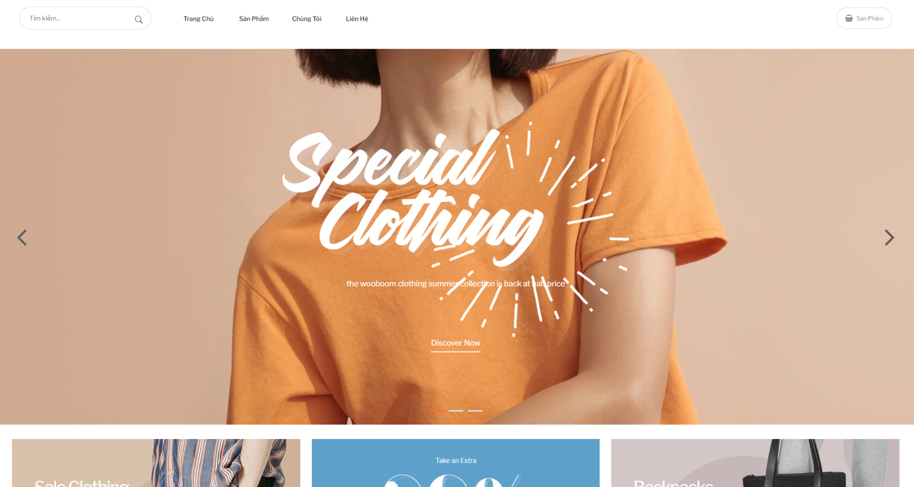
 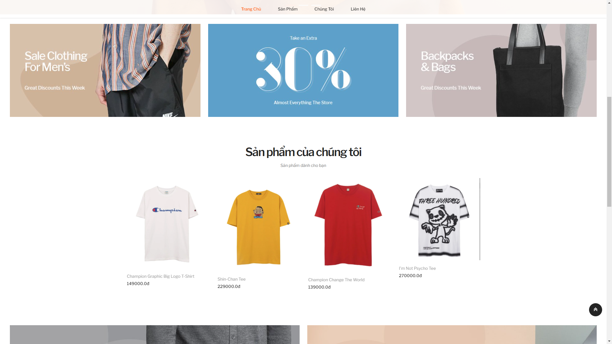
 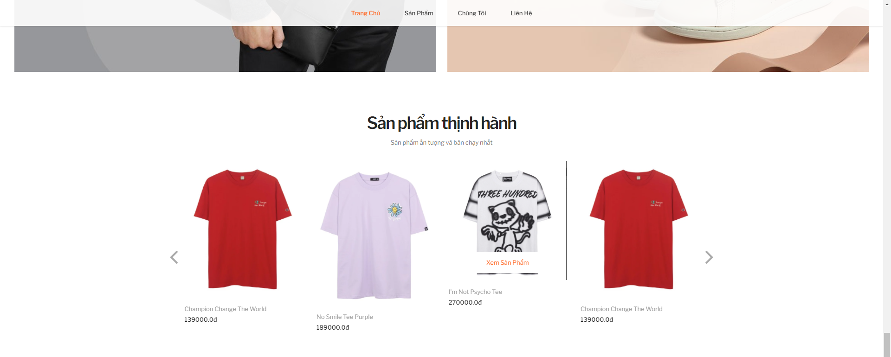
### Product
Category-based navigation for easy exploration of clothing items
 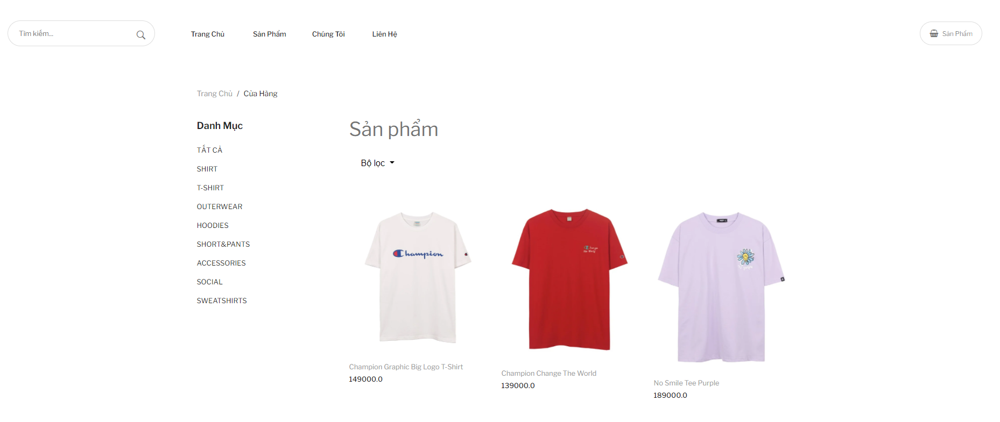
### Login Page:
Login with email + password or sign up for a new account.
 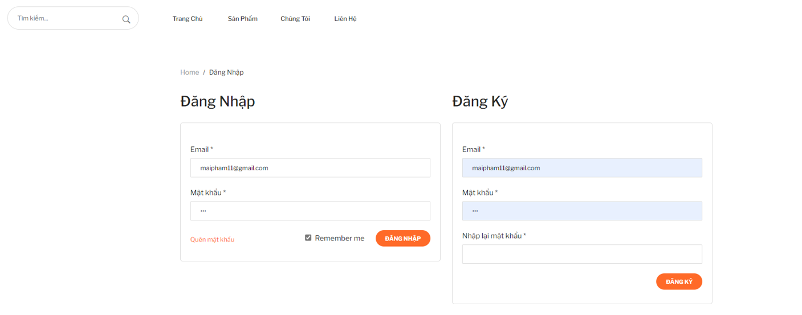
### Cart:
To manage the customers' cart: information, price, and quantities of the items have been added.
 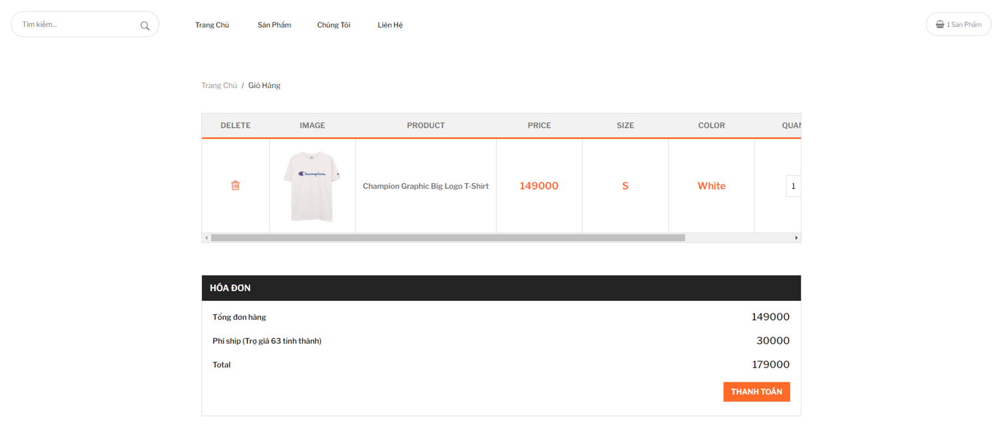
### Payment: 
Customers can choose between paying directly or paying via credit card
 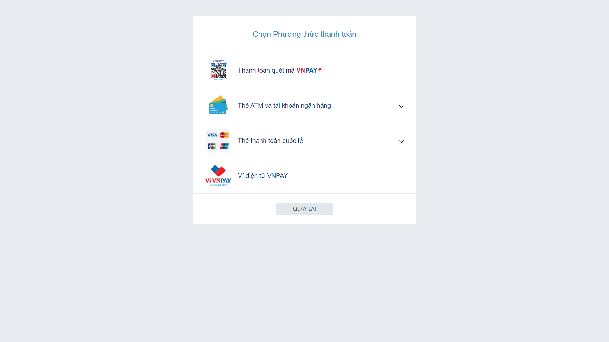
### Shopping History
Customers can view past orders and order details
 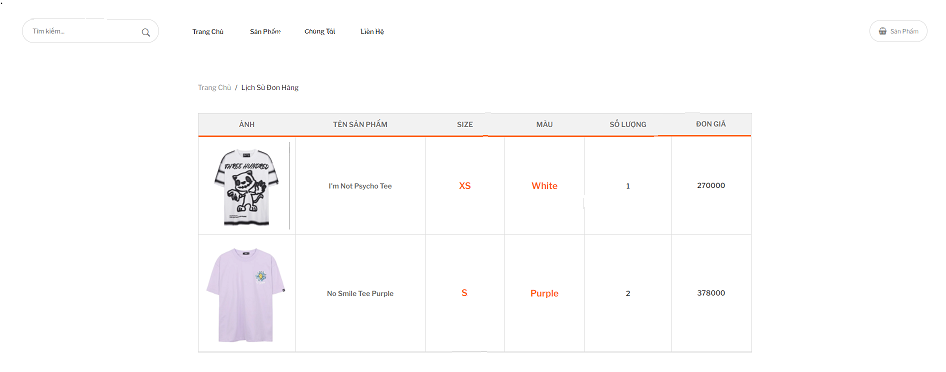
### ProductManager
Sellers can upload, edit, or remove their items
 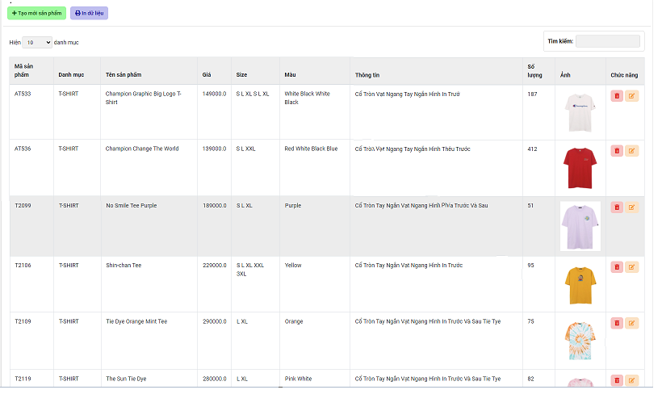
### OrderManager
Sellers can manage order information
 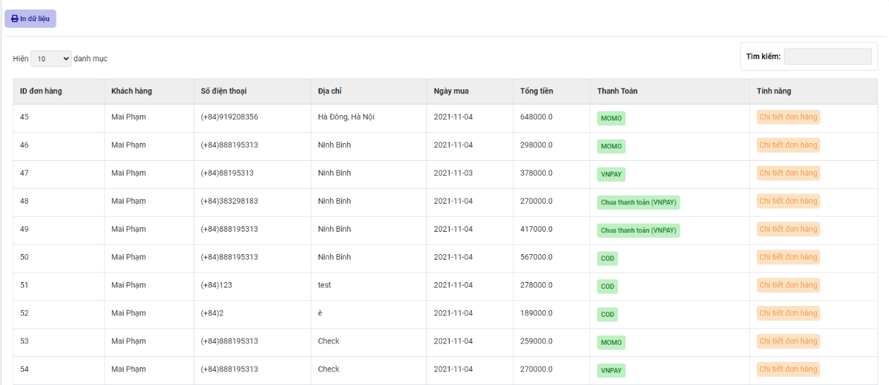

## Sitemap
 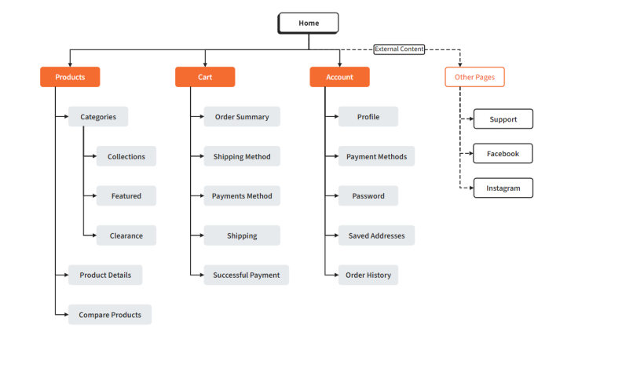

## DatabaseModel
 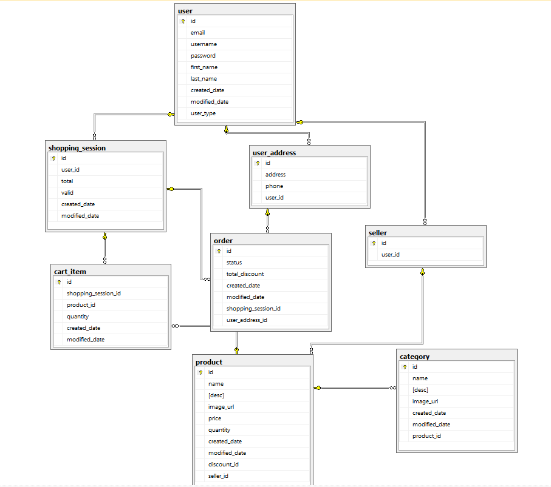
